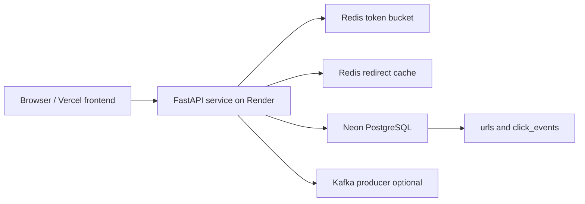

# URL Shortener: Rate Limiting and Analytics

A production-deployed URL shortener built with FastAPI, PostgreSQL, Redis, Docker,
GitHub Actions, and a static Vercel frontend.

**Live API:** https://distributed-url-shortener-with-rate.onrender.com  
**API docs:** https://distributed-url-shortener-with-rate.onrender.com/docs  
**Frontend:** Replace this with your Vercel URL after deployment.

## Architecture



## Features

- Deterministic SHA-256 plus base62 short-code generation
- Idempotent writes with optional idempotency keys
- Async SQLAlchemy connection pooling for PostgreSQL
- Redis cache-aside redirect path
- Atomic Redis Lua token-bucket rate limiting
- Click analytics stored in PostgreSQL
- Optional Kafka producer path, disabled by default
- Dockerized API deployable locally and on Render
- GitHub Actions CI with Postgres, Redis, tests, coverage, and image publishing
- Static frontend deployable on Vercel
- Frontend all-results view for every stored short URL

## Tech Stack

| Layer | Technology |
|---|---|
| API | Python 3.11, FastAPI, Uvicorn |
| Database | PostgreSQL, SQLAlchemy async, asyncpg |
| Cache / limiter | Redis |
| Tests | pytest, pytest-asyncio, coverage, httpx |
| Local runtime | Docker Compose |
| Production API | Render |
| Production DB | Neon |
| Production Redis | Upstash |
| Frontend | Static HTML, CSS, JavaScript |
| Frontend hosting | Vercel |

## API

```bash
curl https://distributed-url-shortener-with-rate.onrender.com/health
```

```bash
curl -X POST https://distributed-url-shortener-with-rate.onrender.com/shorten \
  -H "Content-Type: application/json" \
  -d '{"long_url":"https://github.com/divyesh0406","idempotency_key":"demo-1"}'
```

```bash
curl -i -L --max-redirs 0 https://distributed-url-shortener-with-rate.onrender.com/SHORT_CODE
```

```bash
curl https://distributed-url-shortener-with-rate.onrender.com/analytics/SHORT_CODE
```

List all stored URLs and analytics:

```bash
curl https://distributed-url-shortener-with-rate.onrender.com/analytics
```

Delete a short URL and its click events:

```bash
curl -X DELETE https://distributed-url-shortener-with-rate.onrender.com/urls/SHORT_CODE
```

### Idempotency Keys

`idempotency_key` is optional. Use it when you want retries of the same shorten
request to return the same short URL.

- Same URL plus same key returns the same short code.
- Different URL plus same key returns `409 Conflict`.
- For normal manual use, leave the key blank or use a new key for each URL.

## Local Development

```bash
cp .env.example .env
docker compose up --build
```

The API runs at:

```text
http://localhost:8000
```

Use a separate terminal for tests:

```bash
python -m coverage run -m pytest tests -v
python -m coverage report --fail-under=80
```

Current local coverage:

```text
TOTAL 88%
```

## Frontend

The static frontend lives in `frontend/`.

Open locally:

```text
frontend/index.html
```

It defaults to the Render API:

```text
https://distributed-url-shortener-with-rate.onrender.com
```

## Load Testing

k6 redirect tests are included for both steady smoke testing and local
max-throughput testing. Create a short URL first, then pass its code to k6.

```bash
k6 run -e BASE_URL=http://localhost:8000 -e SHORT_CODE=YOUR_CODE load_test.js
```

Max-throughput local test:

```bash
k6 run -e BASE_URL=http://localhost:8000 -e SHORT_CODE=YOUR_CODE load_test_max.js
```

Production smoke load test:

```bash
k6 run -e BASE_URL=https://distributed-url-shortener-with-rate.onrender.com -e SHORT_CODE=YOUR_CODE load_test.js
```

Measured local Docker Compose results on Windows/Docker Desktop:

| Test | VUs | Duration | Throughput | Avg latency | p50 | p90 | p95 | Max | Error rate | Checks |
|---|---:|---:|---:|---:|---:|---:|---:|---:|---:|---:|
| Controlled redirect smoke | 50 | 60s | 48.84 req/s | 19.32 ms | 9.70 ms | 23.07 ms | 33.55 ms | 432.43 ms | 0.00% | 100% |
| Max-throughput redirect | 200 | 60s | 302.22 req/s | 658.18 ms | 631.54 ms | 800.70 ms | 889.94 ms | 2.22 s | 0.00% | 100% |

The max-throughput test intentionally removes pacing and saturates the local
stack, so higher latency is expected. The important result there is that all
redirect checks passed and the error rate stayed at `0.00%`.

## System Design Tradeoffs

### Deterministic Hashing

The shortener maps `long_url + idempotency_key` to a stable SHA-256 digest and
base62-encodes it. The same input produces the same code, which makes duplicate
shorten requests safe.

### Connection Pooling

The API uses SQLAlchemy's async engine with a bounded pool. This avoids opening
a new database connection for every request while still allowing controlled
burst capacity.

### Token Bucket Rate Limiting

The rate limiter uses a Redis Lua script so token checks and decrements happen
atomically. That matters when multiple app instances receive traffic for the
same client at the same time.

### Cache Aside Redirects

Redirects first check Redis. On cache miss, the API reads PostgreSQL and writes
the destination back to Redis with a TTL. If cache state is stale, the database
remains the source of truth.

### Analytics Path

When Kafka is disabled, redirects write click events directly to PostgreSQL.
The Kafka producer module is ready for an event-streaming upgrade without
blocking the redirect response path.

## Deployment

API deployment details are in `DEPLOYMENT.md`.

Vercel frontend deployment:

1. Create a new Vercel project from this GitHub repo.
2. Set the project root directory to `frontend`.
3. Use Framework Preset `Other`.
4. Leave Build Command empty.
5. Leave Output Directory as `.`.
6. Deploy.

After Vercel gives you a URL, update this README's Frontend link.

## Notes

Render free services can sleep after inactivity. The first request after sleep
may take longer while the container wakes up.
